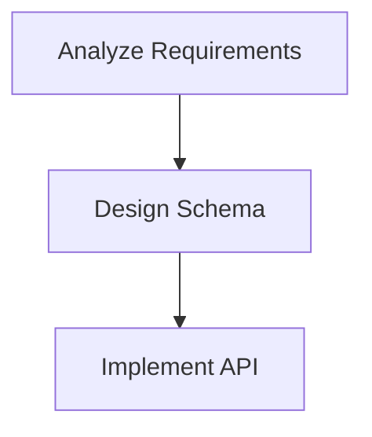

# SmartB Diagrams

AI observability diagrams -- see what your AI is thinking.

SmartB Diagrams lets developers watch AI reasoning in real-time. AI agents emit
Mermaid flowcharts via MCP tools, a file watcher detects changes, WebSocket
broadcasts updates to the browser, and developers see each step as it happens.
Developers can flag nodes to redirect the AI mid-execution.

## Quick Start

```bash
npm install -g smartb-diagrams
smartb init
smartb serve
```

`smartb init` creates a `.smartb.json` config file and a sample `reasoning.mmd`
diagram in the current directory.

`smartb serve` starts the HTTP server, opens your browser, and begins watching
for `.mmd` file changes. Edits appear in the browser within 100ms.

## CLI Commands

### `smartb init`

Initialize a SmartB Diagrams project.

```bash
smartb init [--dir <path>] [--force]
```

| Option | Default | Description |
|--------|---------|-------------|
| `--dir <path>` | `.` | Project directory |
| `--force` | `false` | Overwrite existing config |

Creates `.smartb.json` and a sample `reasoning.mmd` diagram.

### `smartb serve`

Start the diagram viewer server.

```bash
smartb serve [--port <number>] [--dir <path>] [--no-open]
```

| Option | Default | Description |
|--------|---------|-------------|
| `--port <number>` | `3333` | Server port |
| `--dir <path>` | `.` | Project directory |
| `--no-open` | `false` | Do not open browser automatically |

Starts an HTTP server with WebSocket support. Watches `.mmd` files and pushes
changes to all connected browsers in real-time.

### `smartb status`

Check if the SmartB server is running.

```bash
smartb status [--port <number>]
```

| Option | Default | Description |
|--------|---------|-------------|
| `--port <number>` | `3333` | Server port to check |

Displays server uptime, number of diagrams, connected clients, and active flags.

### `smartb mcp`

Start the MCP server for AI tool integration.

```bash
smartb mcp [--dir <path>] [--serve] [--port <number>]
```

| Option | Default | Description |
|--------|---------|-------------|
| `--dir <path>` | `.` | Project directory |
| `--serve` | `false` | Also start HTTP+WS server for browser viewing |
| `--port <number>` | `3333` | HTTP server port (requires `--serve`) |

Runs the MCP server on stdio transport. AI agents (Claude, etc.) connect to this
server to create and update diagrams via structured tools.

## MCP Setup

### Claude Code (recommended)

Add the MCP server with a single command:

```bash
claude mcp add --transport stdio smartb -- npx -y smartb-diagrams mcp --dir .
```

Or create a `.mcp.json` file in your project root:

```json
{
  "mcpServers": {
    "smartb": {
      "command": "npx",
      "args": ["-y", "smartb-diagrams", "mcp", "--dir", "."]
    }
  }
}
```

### Claude Desktop

Add to `~/Library/Application Support/Claude/claude_desktop_config.json`:

```json
{
  "mcpServers": {
    "smartb-diagrams": {
      "command": "npx",
      "args": ["-y", "smartb-diagrams", "mcp", "--dir", "/path/to/project"]
    }
  }
}
```

Replace `/path/to/project` with the absolute path to your project directory.

### With Browser Viewer

To run MCP and the browser viewer in the same process:

```bash
smartb mcp --dir . --serve --port 3333
```

The `--serve` flag starts the HTTP+WS server alongside MCP, sharing the same
DiagramService. Diagram updates from AI tools appear instantly in the browser.

## MCP Tools

| Tool | Description |
|------|-------------|
| `update_diagram` | Create or update a `.mmd` file with Mermaid content |
| `read_flags` | Read all active developer flags from a diagram |
| `get_diagram_context` | Get full diagram state (content, flags, statuses, validation) |
| `update_node_status` | Set node status: `ok`, `problem`, `in-progress`, `discarded` |
| `get_correction_context` | Get structured correction prompt for a flagged node |

## AI Diagram Conventions

These conventions help AI agents produce consistent, readable reasoning diagrams.

### Diagram Direction

- Use `flowchart TD` for sequential reasoning (top to bottom)
- Use `flowchart LR` for parallel or branching logic (left to right)

### Node Naming

- Node IDs: lowercase-hyphenated (e.g., `analyze-requirements`)
- Node labels: short action phrases in quotes (e.g., `["Analyze Requirements"]`)

Example:



### Status Annotations

Track progress by adding status annotations as Mermaid comments:

```
%% @status analyze-requirements ok            -- step completed (green)
%% @status design-schema in-progress          -- currently working (yellow)
%% @status implement-api problem              -- encountered issue (red)
%% @status abandoned-approach discarded       -- abandoned approach (gray)
```

Status values render as node colors in the browser viewer.

### Developer Flags

Developers add flags to signal feedback to the AI:

```
%% @flag design-schema "Consider using a normalized schema instead"
```

AI agents should check for flags using `read_flags` and respond to feedback
using `get_correction_context` for structured guidance.

## Example CLAUDE.md Instructions

Add this to your project's `CLAUDE.md` to enable AI diagram generation:

```markdown
## SmartB Diagrams Integration

This project uses SmartB Diagrams for AI reasoning observability.

### Diagram Updates
- Use the `update_diagram` MCP tool to create/update .mmd files
- Use `flowchart TD` for sequential reasoning steps
- Node IDs should be lowercase-hyphenated (e.g., analyze-input)
- Update node status as you work: in-progress -> ok or problem

### Responding to Flags
- Check for developer flags using `read_flags` before starting work
- When flags exist, use `get_correction_context` to get structured correction guidance
- Address the flag feedback, then update the diagram accordingly

### Status Updates
- Set nodes to `in-progress` when starting a step
- Set nodes to `ok` when a step completes successfully
- Set nodes to `problem` when you encounter an issue
- Set nodes to `discarded` when abandoning an approach
```

## How It Works

AI agents write Mermaid diagrams (`.mmd` files) using MCP tools. A file watcher
powered by chokidar detects changes and triggers a WebSocket broadcast to all
connected browsers. The browser renders the updated diagram instantly using
Mermaid.js, with color-coded node statuses. Developers observe the AI's
reasoning in real-time and can flag specific nodes to redirect the AI's approach.

## Requirements

- Node.js >= 22
- npm or npx

## License

MIT
